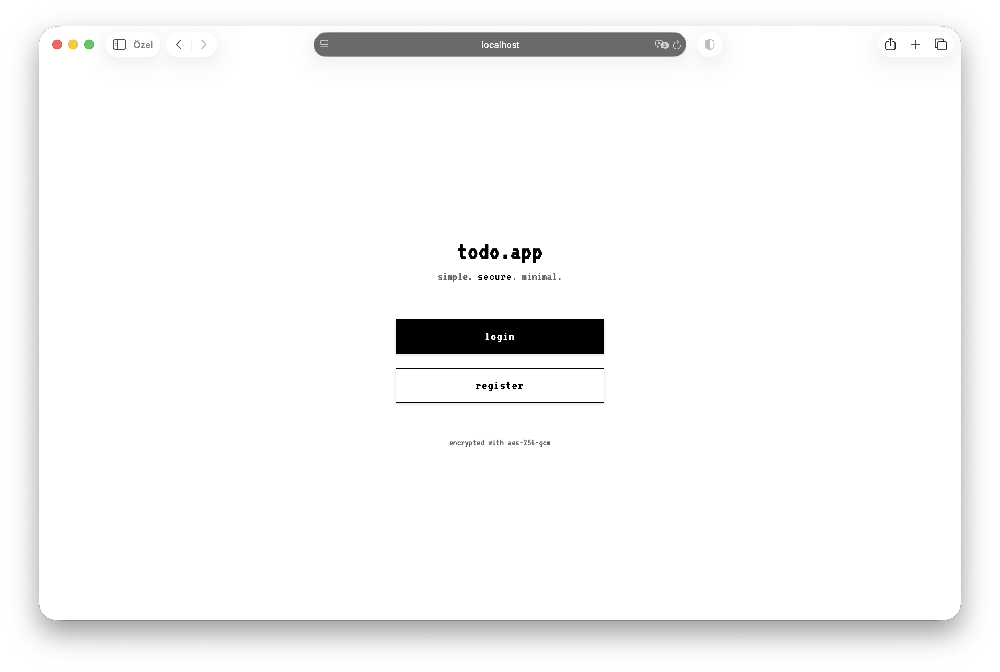
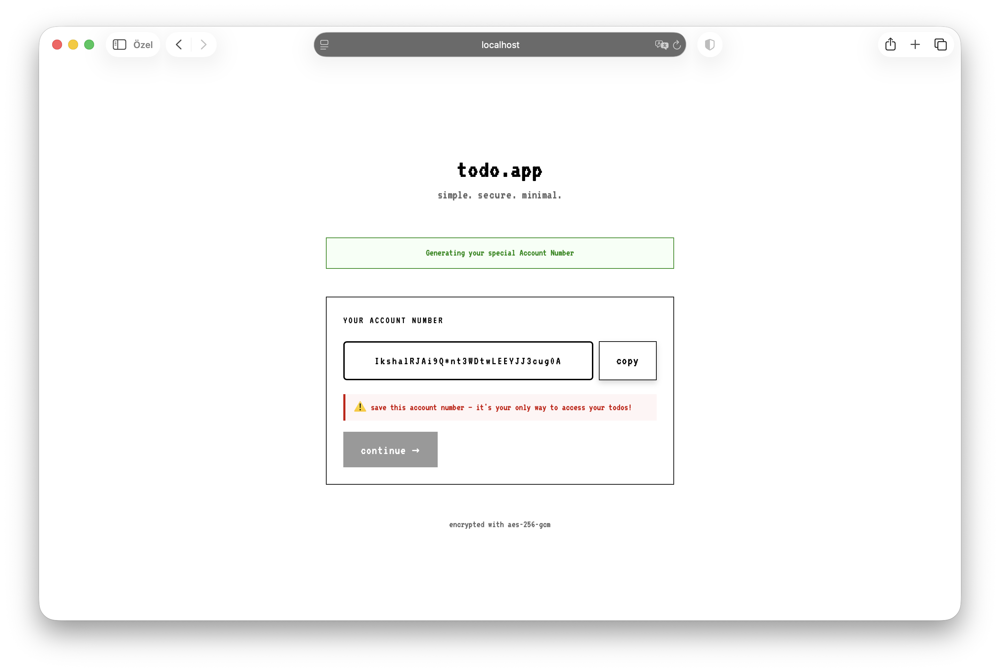

# Not Simple Todo App - Encrypted Todo Application


Secure todo application with Bearer CSPRNG token-based AccountNumber-only authentication and per-user encryption.

<p align="center">
  
  
</p>

---

## Overview

This application is a todo management system that authenticates using only cryptographic AccountNumber (no passwords) and encrypts all data with per-user encryption.

### Key Features

**Security:**
- AccountNumber-only authentication (192-bit entropy, Base64URL, 32 characters)
- AES-256-GCM encryption (title and tags encrypted)
- AAD (Additional Authenticated Data) for cross-user data swap protection
- Per-user encryption keys (unique key per user)
- Zero plaintext storage (AccountNumber never stored in plaintext in database)
- Rate limiting (IP-based, for login/register)
- Log masking (AccountNumber and sensitive information masked)
- Session storage (tokens in sessionStorage instead of localStorage)

**Functional:**
- Todo CRUD operations
- Tag system (encrypted)
- Due date
- Priority levels (low/medium/high)
- Filtering and sorting by tags

**Technical:**
- Frontend: Vanilla JavaScript (no framework dependencies)
- Backend: Go (net/http)
- Database: PostgreSQL
- Reverse Proxy: Nginx
- Containerization: Docker Compose

---

## System Architecture

```
┌─────────────────────────────────────────────────────────────┐
│ FRONTEND (Nginx + SPA)                                      │
│ - index.html, styles.css, js/{app,auth,todo,ui,utils}.js    │
│ - sessionStorage (JWT token, AccountNumber)                 │
│ - Progressive AccountNumber reveal                          │
└──────────────────────┬──────────────────────────────────────┘
                       │ HTTP (Same-Origin Proxy)
                       ▼
┌─────────────────────────────────────────────────────────────┐
│ NGINX (Reverse Proxy)                                       │
│ - SPA routing (try_files)                                   │
│ - /api/* → backend:8080                                     │
│ - Security headers (CSP, X-Frame-Options, etc.)             │
└──────────────────────┬──────────────────────────────────────┘
                       │
                       ▼
┌─────────────────────────────────────────────────────────────┐
│ BACKEND (Go net/http)                                       │
│                                                             │
│ Middleware Chain:                                           │
│   SecurityHeaders → CORS → RateLimit → JWT Auth             │
│                                                             │
│ Handlers:                                                   │
│   Register (2-phase) │ Login │ GetTodos │ CreateTodo │ ...  │
│                                                             │
│ Service Layer:                                              │
│   TodoService: Validation → Encryption → Repository         │
│                                                             │
│ Core Modules:                                               │
│   Encryption (AES-256-GCM + AAD)                            │
│   Auth (JWT, Argon2id, HMAC lookup)                         │
│   Repository (GORM/PostgreSQL)                              │
└──────────────────────┬──────────────────────────────────────┘
                       │
                       ▼
┌─────────────────────────────────────────────────────────────┐
│ POSTGRESQL                                                  │
│                                                             │
│ users:                                                      │
│   - uuid (internal ID, 24 chars)                            │
│   - account_lookup (HMAC-SHA256(pepper, AccountNumber))     │
│   - account_hash (Argon2id(AccountNumber))                  │
│   - encrypted_key (AES-256-GCM encrypted user key)          │
│                                                             │
│ todos:                                                      │
│   - id, user_uuid, title(enc), tags(enc), due_date, priority│
└─────────────────────────────────────────────────────────────┘
```

---

## Security Model

### AccountNumber Generation

AccountNumber is generated with 192-bit cryptographic security:

1. `crypto/rand.Read(24 bytes)` → 192-bit entropy
2. `base64.RawURLEncoding.EncodeToString()` → 32 characters Base64URL
3. Result: 32 characters (A-Z, a-z, 0-9, -, _)
4. Example: "x1_Op2u1bEokj79-HKY5V_EmOe1ATTDq"

### AccountNumber Storage in Database

AccountNumber is NEVER stored in plaintext:

**HMAC Lookup (Fast Lookup):**
```
AccountNumber: "x1_Op2u1bEokj79-HKY5V_EmOe1ATTDq"
    │
    ▼
HMAC-SHA256(ACCOUNT_LOOKUP_PEPPER, AccountNumber)
    │
    ▼
account_lookup: "b37e5a5c1f4e510a..." (64 hex chars)
  ├── Fast lookup (indexed)
  └── One-way function (cannot reverse)
```

**Argon2id Hash (Verification):**
```
AccountNumber: "x1_Op2u1bEokj79-HKY5V_EmOe1ATTDq"
    │
    ▼
Argon2id(AccountNumber)
  ├── Memory: 64MB
  ├── Time: 3
  ├── Parallelism: 2
  └── Format: "$argon2id$v=19$m=67108864,t=3,p=2$salt$hash"
    │
    ▼
account_hash: "$argon2id$v=19$m=67108864,t=3,p=2$..." (stored)
  ├── Verification only
  └── Cannot reverse
```

### Rate Limiting

Token Bucket algorithm is used:
- Capacity: 20 requests
- Refill rate: 1 request/second
- Applied to: `/api/v1/login`, `/api/v1/register`
- IP-based tracking
- Response: `429 Too Many Requests`

### Log Masking

AccountNumber and sensitive information are masked in logs:
```
AccountNumber: "x1_Op2u1bEokj79-HKY5V_EmOe1ATTDq"
    │
    ▼
MaskAccountNumber()
    │
    ▼
Log output: "****************************ATTDq"
  ├── Last 4 characters visible
  └── Rest masked with asterisks
```

### Encryption Architecture

Data encryption uses a multi-layer approach:

1. **Master Key** (`ENCRYPTION_KEY`): 32-byte hex encoded AES key stored in environment variables, used to encrypt/decrypt user-specific keys
2. **User-Specific AES Key**: 32-byte AES-256 key per user, encrypted with master key and stored in `users.encrypted_key`
3. **AAD (Additional Authenticated Data)**: 39-byte structure that prevents cross-user data swap attacks
4. **Data Encryption**: AES-256-GCM encryption with 12-byte nonce per encryption

### AAD Structure (39 bytes)

AAD (Additional Authenticated Data) is used to prevent cross-user data swap attacks:

```
┌────────┬─────┬──────────────┬──────────────┬───────┬─────────┐
│ MAGIC  │ VER │  USER_TAG    │   TODO_ID    │ FIELD │ PURPOSE │
│ "PXAD" │ 0x01│ SHA256[:16]  │  UUID (16B)  │ 1-3   │   1     │
│ 4 byte │ 1B  │   16 byte    │   16 byte    │  1B   │   1B    │
└────────┴─────┴──────────────┴──────────────┴───────┴─────────┘

FIELD: 0x01=Title, 0x02=Content, 0x03=Tags
PURPOSE: 0x01=Encryption
```

### Encrypted Fields

| Field | Encrypted | Description |
|-------|-----------|-------------|
| Title | Yes | AES-256-GCM + AAD |
| Tags | Yes | Each tag encrypted separately |
| Due Date | No | Metadata (date) |
| Priority | No | Metadata (enum) |
| Completed | No | Metadata (boolean) |
| AccountNumber | Not | Plaintext not stored in DB; HMAC hash (account_lookup) and Argon2id hash (account_hash) stored |

## Installation

### Requirements

- Docker & Docker Compose
- Go 1.21+ (for development)
- OpenSSL (for setup.sh)

### Quick Start

```bash
# Setup and build (automatically creates .env, then builds and tests)
./setup.sh && ./build.sh --clean
```

### Environment Variables

`setup.sh` automatically creates the following environment variables:

| Variable | Description | Production |
|----------|-------------|------------|
| `ENCRYPTION_KEY` | 32-byte hex encoded AES key (master key) | `openssl rand -hex 32` |
| `JWT_SECRET` | JWT signing key | `openssl rand -hex 32` |
| `ACCOUNT_LOOKUP_PEPPER` | Pepper for HMAC lookup (>=32 bytes) | `openssl rand -hex 32` |
| `JWT_EXPIRATION_MINUTES` | JWT token validity period | `15` (default) |
| `ALLOWED_ORIGIN` | CORS allowed origins | `*` (dev) or specific domain |
| `APP_ENV` | Environment mode | `development` or `production` |
| `LOG_LEVEL` | Log level | `debug`, `info`, `warn`, `error` |
| `DB_HOST` | PostgreSQL host | `postgres` (Docker) or `localhost` |
| `DB_USER` | PostgreSQL user | `postgres` |
| `DB_PASSWORD` | PostgreSQL password | `postgres` |
| `DB_NAME` | Database name | `todos` |
| `DB_PORT` | PostgreSQL port | `5432` |
| `DB_SSL_MODE` | SSL mode | `disable` (dev) or `require` (prod) |
| `BACKEND_PORT` | Backend server port | `8080` |

## API Reference

### JWT Authentication
Protected endpoints require `Authorization: Bearer <token>` header. Token expires in 15 minutes.

### Endpoints

- `POST /api/v1/register` - Generate AccountNumber (Phase 1) or create account (Phase 2)
- `POST /api/v1/login` - Login with AccountNumber
- `GET /api/v1/todos` - Get all todos (JWT required)
- `POST /api/v1/todos` - Create todo (JWT required)
- `PUT /api/v1/todos/{id}` - Update todo (JWT required)
- `DELETE /api/v1/todos/{id}` - Delete todo (JWT required)

### Error Codes

- `200` - Success
- `201` - Created
- `204` - No Content
- `400` - Bad Request
- `401` - Unauthorized
- `403` - Forbidden
- `404` - Not Found
- `429` - Too Many Requests
- `500` - Internal Server Error

---

## References

- **AES-256-GCM**: NIST SP 800-38D - Galois/Counter Mode (GCM) for Block Ciphers
- **Argon2id**: RFC 9106 - Argon2 Memory-Hard Function for Password Hashing and Key Derivation
- **HMAC-SHA256**: RFC 2104 - HMAC: Keyed-Hashing for Message Authentication
- **JWT**: RFC 7519 - JSON Web Token (JWT)
- **Base64URL**: RFC 4648 Section 5 - Base 64 Encoding with URL and Filename Safe Alphabet
- **UUID**: RFC 4122 - A Universally Unique IDentifier (UUID) URN Namespace
- **Token Bucket Algorithm**: Rate limiting algorithm for traffic shaping
- **Zero-Trust Architecture**: NIST SP 800-207 - Zero Trust Architecture
- **Go**: https://go.dev/
- **PostgreSQL**: https://www.postgresql.org/
- **Nginx**: https://nginx.org/
- **Docker**: https://www.docker.com/
- **GORM**: https://gorm.io/
- **Web Storage API**: https://developer.mozilla.org/en-US/docs/Web/API/Web_Storage_API (SessionStorage)
- **CORS**: https://developer.mozilla.org/en-US/docs/Web/HTTP/CORS
- **Mullvad VPN**: AccountNumber-only authentication model
- **OWASP**: Security best practices
- **NIST**: Cryptographic standard's
- **Go crypto/rand**: https://pkg.go.dev/crypto/rand
- **Go crypto/aes**: https://pkg.go.dev/crypto/aes
- **Go crypto/hmac**: https://pkg.go.dev/crypto/hmac
- **golang.org/x/crypto/argon2**: https://pkg.go.dev/golang.org/x/crypto/argon2
- **github.com/golang-jwt/jwt/v5**: https://pkg.go.dev/github.com/golang-jwt/jwt/v5
- **github.com/google/uuid**: https://pkg.go.dev/github.com/google/uuid
- **gorm.io/driver/postgres**: https://pkg.go.dev/gorm.io/driver/postgres

---

<div align="center">
  
  
  <p><em>How we turned a simple todo app into this</em></p>
</div> 

---

**Last Updated**: January 2026
**Version**: 2.0 (AccountNumber-based authentication)
**Status**: It is an experimental project that has not been completed.
